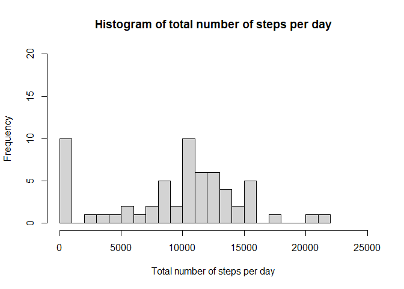
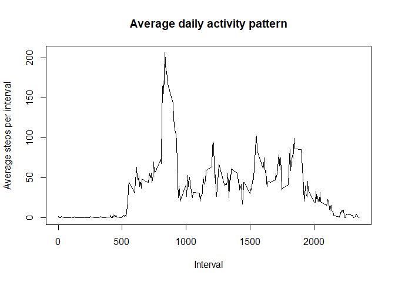
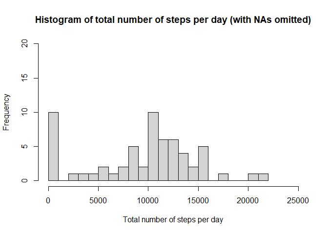
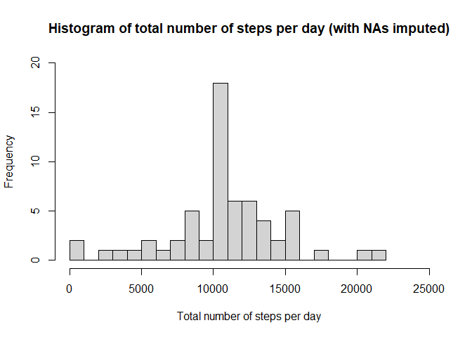
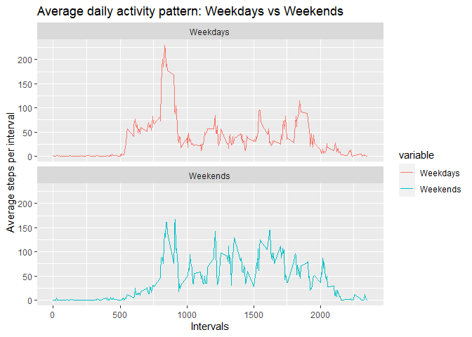
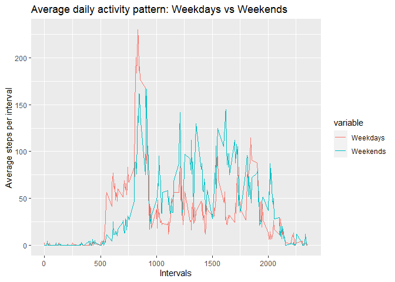

## Loading and preprocessing the data

```r(echo=TRUE)
library(dplyr)
```

```
## 
## Attaching package: 'dplyr'
```

```
## The following objects are masked from 'package:stats':
## 
##     filter, lag
```

```
## The following objects are masked from 'package:base':
## 
##     intersect, setdiff, setequal, union
```

```r
library(readr)

# Clear environment
rm(list=ls())

# Unzip and read data into a tibble
data <- read_csv("activity.csv")
```

```
## Parsed with column specification:
## cols(
##   steps = col_double(),
##   date = col_date(format = ""),
##   interval = col_double()
## )
```

## What is mean total number of steps taken per day?

```r(echo=TRUE)
# Calculate total number of steps per day
count_steps_per_date <- data %>%
  group_by(date) %>%
  summarize(count_steps = sum(steps, na.rm = TRUE))
```

```
## `summarise()` ungrouping output (override with `.groups` argument)
```

```r(echo=TRUE)
# Plot the histogram with NAs omitted
hist(count_steps_per_date$count_steps, breaks = 20,
     main = "Histogram of total number of steps per day",
     xlab = "Total number of steps per day",
     ylim = c(0,20), xlim = c(0,25000))
```

<!-- -->

```r(echo=TRUE)
# Calculate and report the mean and the median of the total number of steps per day
# The values are rounded to represent whole steps
cat(paste0("The mean of total number of steps per day is: ",  round(mean(count_steps_per_date$count_steps))))
```

```
## The mean of total number of steps per day is: 9354
```

```r(echo=TRUE)
cat(paste0("The median of total number of steps per day is: ",  round(median(count_steps_per_date$count_steps))))
```

```
## The median of total number of steps per day is: 10395
```

## What is the average daily activity pattern?

```r(echo=TRUE)
# Average daily activity pattern
# The values are rounded to represent whole steps
mean_steps_per_interval <- data %>%
  group_by(interval) %>%
  summarize(mean_steps = round(mean(steps, na.rm = TRUE)))
```

```
## `summarise()` ungrouping output (override with `.groups` argument)
```

```r(echo=TRUE)
# Plot average daily activity pattern 
plot(mean_steps_per_interval, type = "l", main = "Average daily activity pattern", ylab = "Average steps per interval", xlab = "Interval")
```

<!-- -->

```r(echo=TRUE)
# Calculate and report the 5-minute interval that contains the maximum number of steps
cat(paste0("The 5-minute interval, on average across all the days in the dataset, that contains the maximum number of steps is: ",  
           mean_steps_per_interval$interval[which.max(mean_steps_per_interval$mean_steps)]))
```

```
## The 5-minute interval, on average across all the days in the dataset, that contains the maximum number of steps is: 835
```


## Imputing missing values

```r(echo=TRUE)
# Rows of missing data (NAs)
cat(paste0("The total number of missing values in the dataset is: ", sum(is.na(data$steps))))
```

```
## The total number of missing values in the dataset is: 2304
```

```r(echo=TRUE)
# Copy original data
dataimp <- data

# Check for NAs
colSums(is.na(dataimp))
```

```
##    steps     date interval 
##     2304        0        0
```

```r(echo=TRUE)
# Find the indices for mean_steps_per_interval that match the intervals of NAs in data  
idx <- match(dataimp$interval[is.na(dataimp$steps)], mean_steps_per_interval$interval)

# Impute NAs with the average activity pattern values
dataimp$steps[is.na(dataimp$steps)] <- mean_steps_per_interval$mean_steps[idx]

# Check for again for NAs
colSums(is.na(dataimp))
```

```
##    steps     date interval 
##        0        0        0
```

```r(echo=TRUE)
# Calculate total number of steps per day
count_steps_per_date_imp <- dataimp %>%
  group_by(date) %>%
  summarize(count_steps = sum(steps, na.rm = TRUE))
```

```
## `summarise()` ungrouping output (override with `.groups` argument)
```

```r(echo=TRUE)
# Plot the histogram with NAs omitted for comparison 
hist(count_steps_per_date$count_steps, breaks = 20,
     main = "Histogram of total number of steps per day (with NAs omitted)",
     xlab = "Total number of steps per day",
     ylim = c(0,20), xlim = c(0,25000))
```

<!-- -->

```r(echo=TRUE)
# Plot the histogram with NAs imputed
hist(count_steps_per_date_imp$count_steps, breaks = 20,
     main = "Histogram of total number of steps per day (with NAs imputed)",
     xlab = "Total number of steps per day",
     ylim = c(0,20), xlim = c(0,25000))
```

<!-- -->

```r(echo=TRUE)
# Calculate and report the mean and the median of the total number of steps per day
# The values are rounded to represent whole steps
cat(paste0("The mean of total number of steps per day after imputation is: ",  round(mean(count_steps_per_date_imp$count_steps))))
```

```
## The mean of total number of steps per day after imputation is: 10766
```

```r(echo=TRUE)
cat(paste0("The median of total number of steps per day after imputation is: ",  round(median(count_steps_per_date_imp$count_steps))))
```

```
## The median of total number of steps per day after imputation is: 10762
```
>*The values of these estimates differ from the estimates of the first part of the assignment. Actually they are higher and they are closer together. This result is to be expected as we imputed NAs with the values of the average activity pattern. As we can see from the first histogram NAs had the effect of a high frequency bin for zero total steps (denoting whole days with NAs). At the second histogram we can see that the bin for zero total steps has a lower frequency while the bin for 10000-11000 total steps has a higher frequency. The total number of steps of the average activity pattern are 10762 and days full with NAs now have this total number of steps. Thus, the imputation had the effect of diminishing some outliers (zero total steps resulting from NAs for whole days) and thus the mean is closer to the median.*

## Are there differences in activity patterns between weekdays and weekends?

```r(echo=TRUE)
# load required library lubridate
require(lubridate)
```

```
## Loading required package: lubridate
```

```
## 
## Attaching package: 'lubridate'
```

```
## The following objects are masked from 'package:base':
## 
##     date, intersect, setdiff, union
```

```r(echo=TRUE)
# Create day number (1:7) from date
dayNum <- wday(dataimp$date)

# add column weekday as factor with two levels with labels weekend and weekday
dataimp$weekday <- factor((dayNum > 1 & dayNum < 7), levels=c(FALSE, TRUE), labels=c('weekend', 'weekday'))

# Average daily activity pattern for weekdays
mean_steps_per_interval_wdays <- dataimp[(dataimp$weekday == levels(dataimp$weekday)[2]),] %>%
  group_by(interval) %>%
  summarize(Weekdays = round(mean(steps, na.rm = TRUE)))
```

```
## `summarise()` ungrouping output (override with `.groups` argument)
```

```r(echo=TRUE)
# Average daily activity pattern for weekends
mean_steps_per_interval_weekends <- dataimp[(dataimp$weekday == levels(dataimp$weekday)[1]),] %>%
  group_by(interval) %>%
  summarize(Weekends = round(mean(steps, na.rm = TRUE)))
```

```
## `summarise()` ungrouping output (override with `.groups` argument)
```

```r(echo=TRUE)
# Add average daily activity pattern for weekends as a new column to weekdays
mean_steps_per_interval_wdays$Weekends <- mean_steps_per_interval_weekends$Weekends

# Load required libraries
require(ggplot2)
```

```
## Loading required package: ggplot2
```

```r(echo=TRUE)
library(reshape2)

# Reshape data for plotting
dd = melt(mean_steps_per_interval_wdays, id.vars = c("interval"))

# Create panel plot
g1 <- ggplot(data= dd) +
      geom_line(aes(x=interval, y=value, colour=variable)) +
      facet_wrap( ~ variable, nrow = 2, ncol = 1) + 
      labs(title = "Average daily activity pattern: Weekdays vs Weekends", 
           x = "Intervals", y = "Average steps per interval") 
# Show the plot
g1
```

<!-- -->
 
>*We can see the differences in activity patterns between weekdays and weekends. On weekends there are less average steps during the morning (5:15-9:00) and the evening (18:20-19:35) than on weekdays. On weekends on the other hand there are more average steps during the day (10:00 - 20:30). This behavior is more apparent in the following plot:*


```r(echo=TRUE)
g2 <- ggplot(data= dd) +
      geom_line(aes(x=interval, y=value, colour=variable)) +
      labs(title = "Average daily activity pattern: Weekdays vs Weekends", 
           x = "Intervals", y = "Average steps per interval") 
g2
```

<!-- -->
